# Unit 01

### 1 - Word List \(0001-0020\) 

0001 -  **afraid** /əˈfreɪd/ \[A1\]

释义：When someone is afraid, they feel fear.

例句：The woman was afraid of what she saw.

0002 - **agree** /əˈɡriː/ \[A1\]

释义：To agree is to say "yes" or think the same way.

例句：A: The food is very good in that restaurant.

 B: I agree with you.

0003 - **angry** /ˈæŋɡri/ \[A1\]

释义：When someone is angry, they may want to speak loudly and fight.

例句：She didn't do her homework, so her father is angry.

0004 - **arrive** /əˈraɪv/ \[A1\]

释义：To arrive is to get to or reach some place.

例句：The bus always arrives at the corner of my street at 4:00.

0005 - **attack** /əˈtæk/ \[A2\]

释义：To attack is to try to fight or to hurt.

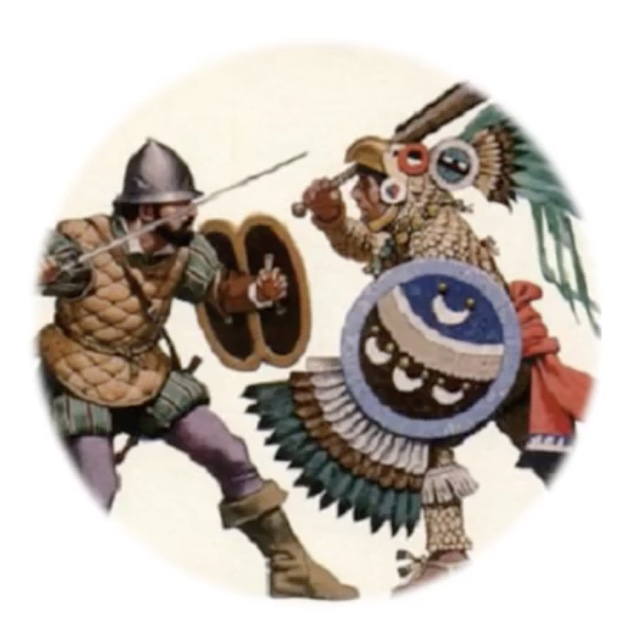

例句：The man with the sword attacked the other man first.

0006 - **bottom** /ˈbɒtəm/ /ˈbɑːtəm/ \[A2\]

释义：The bottom is the lowest part.

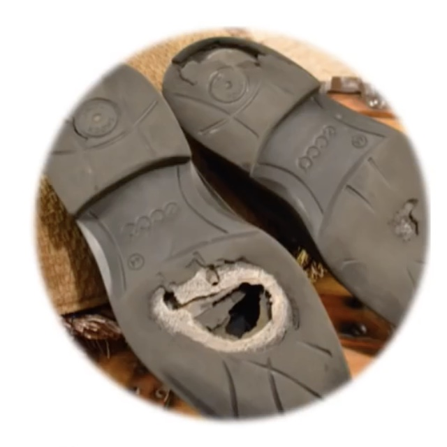

例句：The bottom of my shoe has a hole in it.

0007 - **clever** /ˈklevə\(r\)/ /ˈklevər/ \[A2\]

释义：When someone is clever, they can solve a hard puzzle or problem.

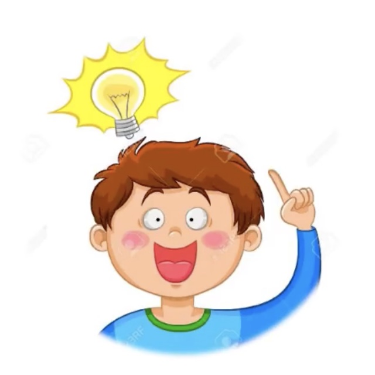

例句：The clever boy thought of a good idea.

0008 - **cruel** /ˈkruːəl/ \[B1\]

释义：When someone is cruel, they do bad things to hurt others.

例句：The cruel man yelled at his sister.

0009 - **finally** /'faɪnəlɪ/ \[A2\]

释义：If something happens finally, it happens after a longtime or at the end.

例句：He finally crossed the finishing line after five hours of running.

0010 - **hide** /haɪd/ \[A2\]

释义：To hide is to try not to let others see you.

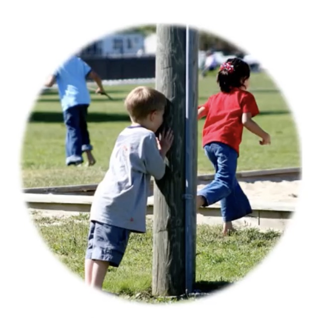

例句：The other children will **hide** when you count to 100.

0011 - **hunt** /hʌnt/ \[B1\]

释义：To hunt is to look for or search for an animal to kill.

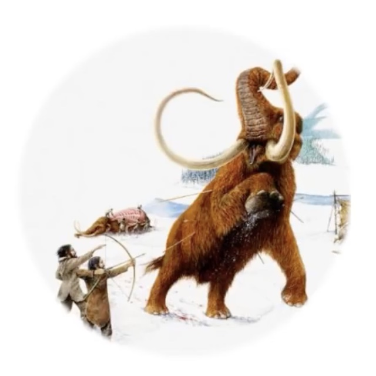

例句：Long ago, people **hunted** with bows\(弓\) and arrows\(箭\).

0012 - **lot** /lɒt/ /lɑːt/ \[A1\]

释义：A lot means a large number or amount of people, animals, things, etc.

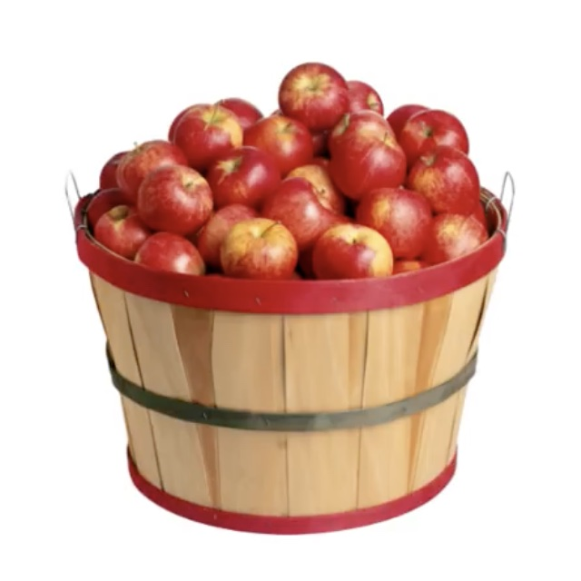

例句：There are a **lot** of apples in the basket.

0013 - **middle** /ˈmɪdl/ \[A2\]

释义：The middle of something is the center or halfway\(中间的\) point.

例句：The Canadian flag has a maple\(枫树\) leaf in the **middle** of it.

0014 - **moment** /ˈməʊmənt/ \[A1\]

释义：A moment is a second or a very short time.

例句：I was only a few **moments** late for the meeting.

0015 - **pleased** /pliːzd/ \[A2\]

释义：When someone is pleased, they are happy.

  
例句：She was **pleased** with the phone call she received.

0016 - **promise** /ˈprɒmɪs/ /ˈprɑːmɪs/ \[A2\]

释义：To promise is to say you will do something for sure.

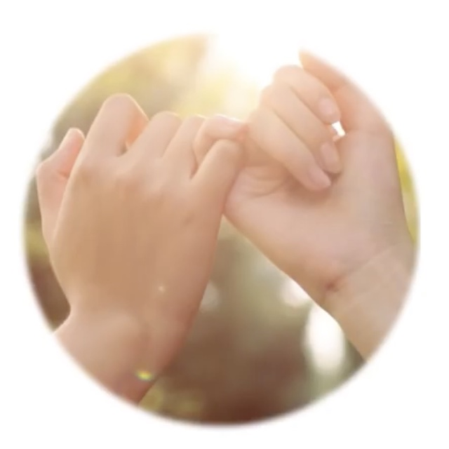

例句：He **promised** to return my key by tomorrow.

0017 - **reply** /rɪˈplaɪ/ \[A2\]

释义：To reply is to give an answer or say back to someone.

例句：She asked what time his meeting was. He **replied**: “ At three.”

0018 - **safe** /seɪf/ \[A2\]

adj. 安全的；可靠的；平安的

n. 保险箱；冷藏室；纱橱

释义：When a person is safe, they are not in danger.

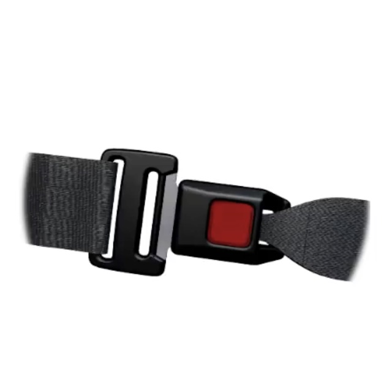

例句：Put on your seat belt in a car to be **safe**.

0019 - **trick** /trɪk/ \[B1\]

n. 戏法，把戏；计谋，诡计，花招；诀窍，技巧，技艺

vt. 哄骗；欺骗；打扮

adj. 用于特技的；有意捉弄人的

释义：A trick is something you do to fool another person.

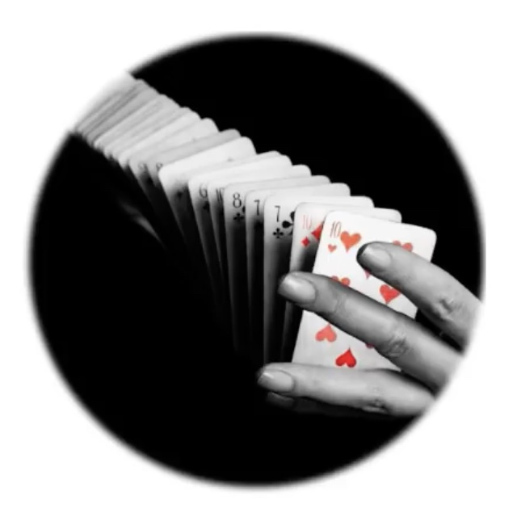

例句：His card **trick** really surprised us.

0020 - **well** /wel/ \[A1\]

adv. 好

释义：You use well to say that something was done in a good way.

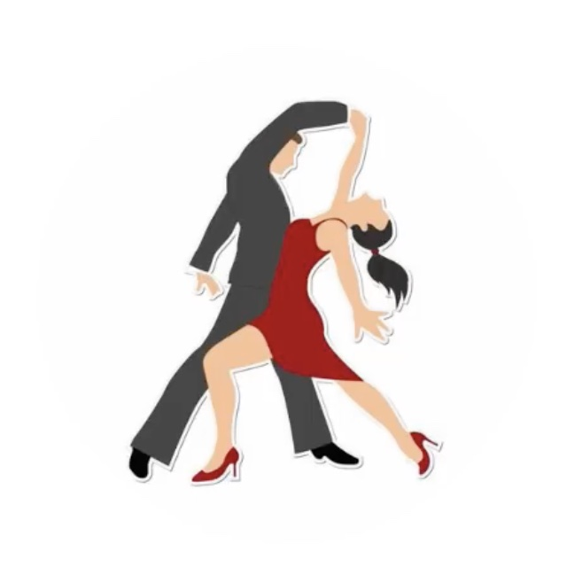

例句：The couple can dance quite **well**.

### 2 - Story 

**The Lion and the Rabbit**

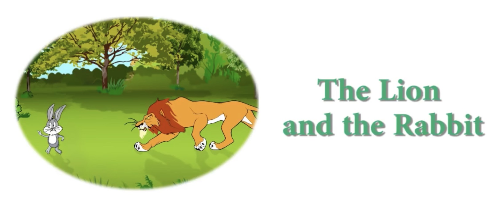

A **cruel** lion lived in the forest. Every day, He killed and ate a **lot** of animals. The other animals were **afraid** the lion would kill them all.

The animals told the lion, “Let’s make a deal. If you **promised** to eat only one animal each day, then one of us will come to you every day, Then you don’t have to **hunt** and kill us.”

The plan sounded **well** though-out\(慎重考虑后产生的\) to the lion. So he **agreed**, but he also said, “If you don’t come every day, I promise to kill all of you the next day!”

Each day after that, one animal went to the lion so that the lion could eat it. Then all the other animals were **safe**.

**Finally**, it was the rabbit’s turn to go to the lion. The rabbit went very slowly that day, so the lion was **angry** when the rabbit finally **arrived**.

The lion angrily asked the rabbit, “Why are you late?”

“I was **hiding** from another lion in the forest. That lion said he was the king , so I was afraid.”

The lion told the rabbit, “I am the only king here! Take me to that other lion, and I will kill him.”

The rabbit **replied**, “I will be happy to show you where he lives.”

The rabbit led the lion to an old well in the **middle** of forest. The well was very deep with water at the **bottom**. The rabbit told the lion, “Look in there. The lion lives at the bottom.”

When the lion looked in the well, he could see his own face in the water. He thought that was the other lion. Without waiting another **moment**, the lion jumped into the well to **attack** the other lion. He never came out.

All of the other animals in the forest were very **pleased** with the rabbit’s **clever** **trick**.

